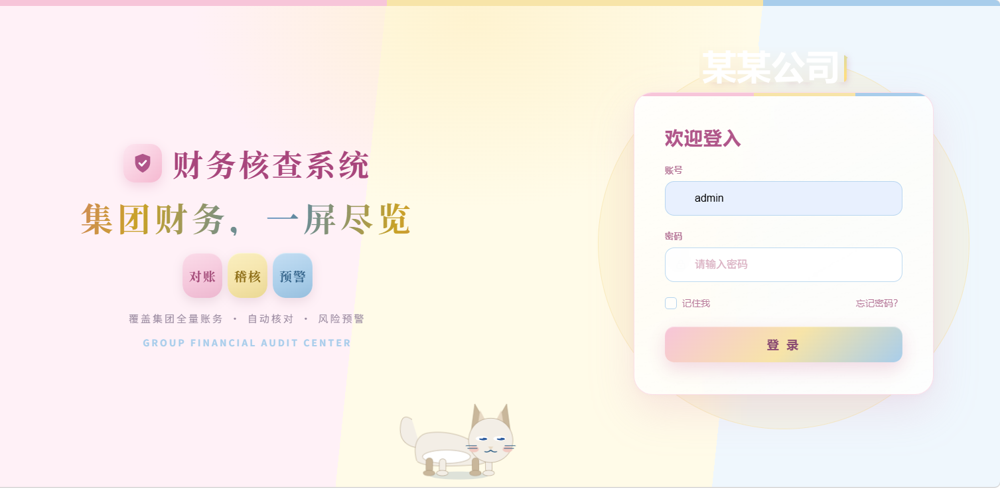

# 用 WorkBuddy 给自建财务系统做全站换肤

> 提交前，请先搜索社区案例集和蓝皮书，确认场景或任务没有重复。如果只是补充或优化已有方法，请优先修改原案例。

## 场景描述

我维护一套内部财务核查系统（前端是 30+ 个原生 HTML 页面，跑在局域网 8080 端口）。初始主题是一套粉色系，想整体换成新配色（轻多巴胺三色：浅粉主色 + 浅蓝表头 + 浅黄点缀）。

难点在于：系统里 **34 个页面中有 24 个共用同一套 CSS 变量**（`:root` 下约 22 个变量名），但旧粉色并不只存在于变量里——还散落在 `body` 的 `radial-gradient` 背景、内联 `style` 徽章色、以及个别页面的 JS 图表调色板数组里。人工逐页改 34 页既慢又容易"粉 X 混杂"（旧色残留），而且每次改完还得逐页开浏览器肉眼核对。

## 想要完成的任务

- 输入：`app/*.html`（24 个共用变量页 + 10 个独立模块页）
- 目标：全站统一换肤，旧主题色**残留为 0**，且表头、语义色（红/橙/绿/灰）保持可读
- 交付物：①一份不碰线上的预览页 + 配色对照表供确认；②确认后全站落地；③五重验证报告

## 使用的 Skill

| Skill | 用途 | 来源或安装方式 |
| --- | --- | --- |
| snit-theme-recolor | 全站换肤主流程：出预览 → 确认 → 全站落地（改 `:root` 变量 + 清硬编码色 + 五重验证） | 基于 WorkBuddy 技能机制自定义沉淀（项目/用户级 Skill，读者可照方法论复刻） |
| snit-theme-tweak | 落地后的逐元素微调（某条间距、某个标题栏深浅、某列表头） | 同上 |

> 没有这两个 Skill 也能做：核心是让 WorkBuddy 按"出预览 → 确认 → 落地 → 验证"的方法论直接执行，下面步骤不依赖私有工具也能复现。

## 前置条件

- WorkBuddy 版本：支持技能与 `present_files` 预览的稳定版（2026 年中起即可）
- 操作系统：Windows 11（脚本路径为 Windows 风格，Linux/macOS 需相应调整）
- 所需账号或权限：本地 8080 系统的管理员账号（用于真渲染验证时登录）；**请勿在公开案例里泄露生产账号**
- 所需输入文件：前端 `app` 目录下所有 `.html`；以及一套换肤脚本（见"遇到的问题"里的变量替换思路，可用 Python 自行实现）

## 在 WorkBuddy 中的操作

1. **出预览，不碰线上**：让 WorkBuddy 把元素最全的一页（如 `item_query.html`）复制到 `tmp/_theme_preview/` 下，只替换 `:root` 变量块并批量换硬编码色，注入假数据让预览页打开即有内容，真渲染截图，同时生成一份「配色对照表.html」（色卡 + 新旧对照 + 组件实样）。此时线上 0 改动。
2. **确认后全站落地**：先在 WorkBuddy 里跑 `--dry` 预演（必须"残留旧色 0"），再改 1 页验证，确认无误后推全站。脚本改前自动备份 `*.bak_theme_soft`，纯前端改动 **Ctrl+F5 即生效，不用重启服务**。
3. **五重验证（缺一不可）**：①语法体检；②线上真渲染断言（`h1Color`/`thBg`/`bodyBg`/`hasPink=false`）；③抽查多页（完整型 / 精简型 / 特殊型）；④负向对照（用备份跑同一套断言必须报错，证明断言有牙齿）；⑤全站静态断言 24 页逐页核新值 + 残留旧色=0。

## 提示词或任务指令

```text
把 8080 财务核查系统全站换成轻多巴胺配色（浅粉主色 + 浅蓝表头 + 浅黄点缀）。
要求：
1. 先出预览页 + 配色对照表给我确认，不要改线上任何文件；
2. 确认后再全站落地，变量名沿用 --rose-* 只改色值；
3. 必须清除所有旧主题色硬编码（body 背景渐变、内联 style、JS 图表调色板），残留旧色为 0；
4. 表头用邻近冷色（浅蓝）划边界，语义色红/橙/绿/灰只同步明度不改含义；
5. 落地后做五重验证，给出验证报告。
```

## 在 WorkBuddy 中的效果

最终交付：一份预览页（确认阶段）、一份配色对照表，以及全站 24 个共用变量页落地后的新主题。下面是落地后的真机渲染截图（换肤后的登录页：粉底 + 浅黄 / 浅蓝色带 + 浅蓝登录卡片 + 粉蓝渐变按钮，整体为轻多巴胺配色）：

```md

```

> 💡 如需让案例更完整，可再补 1~2 张内页截图（配色对照表页、完整型页如 `item_query`、特殊型页如 `receipt_entry`），放进 `assets/` 后在上一行追加引用即可。

## 验收标准

- 24 个共用变量页的 `--rose-deep` / `--rose` 等已变为新值，且 `grep` 全站**残留旧主题色为 0**（非 0 即漏改）
- 表头为浅蓝底深蓝字，与数据区边界清晰；红/橙/绿语义色仍保留"报错/警告/通过"的含义
- 纯前端改动，Ctrl+F5 即生效，**无需重启 8080 服务**
- 五重验证全部通过；负向对照（备份页）必须让断言报错

## 遇到的问题

1. **旧色不只藏在变量里**：`body` 的 `radial-gradient` 背景、内联 `style="background:#..."` 徽章、以及 JS 数组里的图表调色板（如 `MC_PALETTE`）三处都要清，漏了就"粉 X 混杂"。→ 把漏掉的色值补进替换脚本的硬编码规则。
2. **表头 `:nth-child` 压不住**：原层已有 `thead th:nth-child(2),thead th:nth-child(3)`（特异性 0,0,2），新写的裸 `thead th`（0,0,1）盖不住 → 必须同样写 `:nth-child(2/3)` 且位置在其后。
3. **Google Fonts 在本机全部 404**：代理拦截 `gstatic` 的 ttf，浏览器静默回退系统字体，设计稿与真机不一致。→ 换字体只能用**本机已装**字体，且必须用 `FontFaceSet.check()` 检测，别用 canvas 量宽度（中文字体宽度相近会假阳性）。
4. **独立模块页漏注入**：部分自带完整 CSS 的模块页不走应用外壳，二代配色需逐页写进各自 `<style>`；漏了就"功能正常但标题栏/表头还是旧的"。→ 用脚本扫全站找缺块页补全。

## 安全与限制

- 换肤脚本改前**自动备份** `*.bak_theme_soft`，确认稳定几天后再清理；回退只需把备份拷回。
- **内网系统勿暴露公网**：本案例的 8080 系统是局域网财务系统，含业务数据，绝不可用"发布为应用"等方式直接暴露到公网；外网访问应走内网穿透 / 端口映射。
- **账号脱敏**：真渲染验证需要登录本地管理员账号，投稿时请勿写出真实生产账号密码；本地与生产的默认凭据不同，注意区分。
- 企业数据不外泄：截图前确认不含真实财务数据，必要时用假数据 / 打码。

## 可以怎样复用

任何**自有前端项目**的全站换肤都能套这套方法论：

1. 先摸清"主题到底存在哪"——通常是 `:root` CSS 变量，但务必排查背景渐变、内联色、JS 调色板三类硬编码；
2. 用"**改少数变量名 + 清硬编码**"代替逐页重构，改动面最小、可一键回退；
3. **先出预览确认、再全站落地**，纯前端改动免重启；
4. 用"五重验证"（语法 / 真渲染 / 多页抽查 / 负向对照 / 全站静态断言）兜底，尤其负向对照能保证你的断言真的有牙齿。
